```markdown
# Architecture Documentation - MechBot 2.0x

## C4 Model Diagrams

### 🌐 Context Diagram (Level 1)

```mermaid
C4Context
    title System Landscape
    Person(owner, "Dueño del Vehículo", "Usa la app para diagnóstico y reparaciones")
    Person(mechanic, "Técnico Certificado", "Recibe alertas y guías de reparación")
    System(mechbot, "MechBot 2.0x", "Plataforma de diagnóstico inteligente")
    
    System_Ext(obd, "Dispositivo OBD-II", "Provee datos de telemetría")
    System_Ext(workshop, "Sistemas de Taller", "WMS/CRM de talleres asociados")
    
    Rel(owner, mechbot, "Usa para")
    Rel(mechanic, mechbot, "Consulta")
    Rel(obd, mechbot, "Envía datos via")
    Rel(mechbot, workshop, "Integra con")
```


### 🏗️ Container Diagram (Level 2)

```mermaid
C4Context
    title Arquitectura de Contenedores
    Container(spa, "Aplicación Web", "React + Next.js", "Interfaz 3D/AR")
    Container(mobile, "App Móvil", "React Native", "Conexión Bluetooth OBD")
    Container(api, "API Gateway", "FastAPI", "Enrutamiento y Auth")
    Container(ml, "Servicio ML", "Python + ONNX", "Modelos XGBoost/BERT")
    ContainerDb(db, "Base de Datos", "PostgreSQL + Cassandra", "Datos transaccionales y telemetría")

    Rel(spa, api, "HTTPS/2")
    Rel(mobile, api, "gRPC")
    Rel(api, ml, "gRPC")
    Rel(ml, db, "SQL/NoSQL")
```


### 🔧 Component Diagram (Level 3 - Core Service)

```mermaid
C4Component
    title Servicio de Diagnóstico
    Component(api, "API REST", "FastAPI", "Endpoint /diagnosis")
    Component(stream, "Stream Processor", "Spark Structured Streaming", "Procesa Kafka")
    Component(model, "Model Serving", "TorchServe", "Inferencia en <50ms")
    Component(cache, "Feature Cache", "Redis", "TTL=1h")
    
    Rel(api, stream, "Publica eventos")
    Rel(stream, model, "Batch scoring")
    Rel(model, cache, "Consulta features")
    Rel_U(api, cache, "Lee resultados")
```


### 🧩 Code Diagram (Level 4 - Diagnosis Flow)
```python
# diagnosis_service.py
class DiagnosisController:
    @validate_token  # JWT Auth
    async def diagnose(self, request: DiagnosisRequest):
        # 1. Validar entrada
        vehicle = await self.vin_service.verify(request.vin)
        
        # 2. Procesar en streaming
        kafka.produce(
            topic="raw_telemetry",
            value=request.json()
        )
        
        # 3. Consultar modelo
        features = await feature_store.latest(request.vin)
        prediction = ml_model.predict(features)
        
        # 4. Generar guía AR
        ar_guide = ARGenerator.for_code(
            prediction.fault_code,
            lang=request.language
        )
        
        return DiagnosisResponse(
            prediction=prediction,
            ar_guide=ar_guide
        )
```

## Key Architectural Decisions

1. **Patrón CQRS**:
   ```mermaid
   graph LR
       Command[Comandos] --> Kafka
       Query[Consultas] --> PostgreSQL
       Kafka --> Spark --> Cassandra
   ```

2. **Seguridad Multi-Capa**:
   - TLS 1.3 everywhere
   - JWT con doble firma (HS512 + Ed25519)
   - Segmentación de red por VLANs

3. **Patrones de Resiliencia**:
   ```yaml
   # helm/values.yaml
   resilience:
     circuit_breaker:
       failureThreshold: 3
       timeout: 5000ms
     retry:
       attempts: 3
       backoff: 200ms
   ```

## Deployment Topology

```mermaid
C4Deployment
    title AWS EKS Cluster
    DeploymentNode(eks, "EKS Cluster", "Kubernetes 1.25") {
        DeploymentNode(ng1, "Node Group - General") {
            Container(api)
            Container(ml)
        }
        DeploymentNode(ng2, "Node Group - Data") {
            ContainerDb(db)
        }
    }
    
    System_Ext(s3, "S3 Bucket", "Almacenamiento modelos ML")
    Rel(db, s3, "Backups diarios")
```

## 📊 Metrics Dashboard
| Component          | Metric                | Threshold  |
|--------------------|-----------------------|------------|
| API Gateway        | Latencia p95          | < 500ms    |
| Spark Streaming    | Lag de procesamiento  | < 1 min    |
| PostgreSQL         | CPU Usage             | < 70%      |
| Redis              | Hit Ratio             | > 95%      |

**Equipo Técnico MechBot 2.0x**  
📌 [Documentación Viva](https://docs.mechbot.tech/architecture)  
🔗 [Plantilla C4 Model](.docs/c4_template.puml)  
🔄 Última Actualización: 2023-11-15
```

### Notas Adicionales:
1. **Generación Automática**: Los diagramas se actualizan via CI/CD usando:
   ```bash
   python -m diagrams.c4 --input ./architecture --output ./docs
   ```
2. **Niveles de Detalle**:
   - **Nivel 1**: Stakeholders externos
   - **Nivel 2**: Servicios principales
   - **Nivel 3**: Flujos internos
   - **Nivel 4**: Código crítico

3. **Herramientas Recomendadas**:
   - [Structurizr](https://structurizr.com/) para edición
   - [C4-PlantUML](https://github.com/plantuml-stdlib/C4-PlantUML) para renderizado
