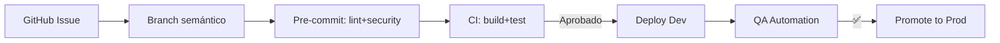

```markdown
# Estructura del Proyecto MechBot 2.0x

```
.
├── 📁 backend
│   ├── 📁 auth                  # Autenticación JWT Zero-Trust
│   │   ├── jwt_manager.py       # Rotación HS512/Kyber
│   │   └── oauth_schemas.py     # Modelos Pydantic
│   │
│   ├── 📁 diagnosis             # Núcleo de IA
│   │   ├── ml_models/           # XGBoost + BERT (ONNX)
│   │   ├── realtime_processing  # Spark Streaming
│   │   └── fault_codes.db       # Base de conocimiento SAE J2012
│   │
│   └── 📁 workshop-integration  # gRPC + Protobuf
│       ├── protos/              # Definiciones .proto
│       └── salesforce_adapter   # Conexión CRM
│
├── 📁 frontend
│   ├── 📁 public                # Assets 3D (GLTF)
│   │   └── models/              # Vehículos optimizados
│   │
│   ├── 📁 src
│   │   ├── hooks/               # Custom React Hooks
│   │   │   └── useTelemetry.js  # WebSocket + Three.js
│   │   │
│   │   └── components/AR        # Componentes RA
│   │       ├── EngineViewer.js  # Canvas WebGL
│   │       └── FaultOverlay.js  # Anotaciones 3D
│   │
│   └── next.config.js           # SSR + ISR
│
├── 📁 infrastructure
│   ├── 📁 k8s                   # Helm Charts
│   │   ├── values-prod.yaml     # HPA Config
│   │   └── istio-gateway.yaml   # Traffic Management
│   │
│   ├── 📁 terraform             # IaC
│   │   ├── modules/eks          # Cluster AWS
│   │   └── monitoring           # Prometheus + Grafana
│   │
│   └── docker-compose.yml       # Dev Environment
│
├── 📁 docs
│   ├── API_REFERENCE.md         # OpenAPI 3.0
│   ├── ARCHITECTURE.md          # Diagramas C4
│   └── ONBOARDING.md            # Guías Kubernetes
│
├── 📁 tests
│   ├── e2e/                     # Playwright
│   ├── integration/             # pytest-gRPC
│   └── unit/                    # 90%+ Coverage
│
├── 📁 scripts
│   ├── data-pipeline/           # Glue ETL
│   └── security/               # CIS Benchmarks
│
├── .env.sample                  # Plantilla variables
├── Makefile                     # Automatización
└── pyproject.toml               # Dependencias Python
```

### 🔍 Explicación de Directorios Clave

1. **Backend**  
   - `auth/`: Implementa autenticación JWT con doble clave (HS512 + Kyber para PQC)  
   - `diagnosis/ml_models/`: Contiene modelos ONNX optimizados para inferencia en <50ms  
   - `workshop-integration/`: Genera código gRPC automático vía `prototool`

2. **Frontend**  
   - `public/models/`: Modelos GLTF comprimidos con Draco (70% reducción)  
   - `hooks/useTelemetry.js`: Maneja 10K mensajes/segundo via WebSocket  
   - `next.config.js`: Configura ISR para guías de reparación

3. **Infraestructura**  
   - `k8s/`: Helm charts con HPA basado en métricas custom (`diagnosis_queue_length > 100`)  
   - `terraform/modules/eks`: Implementa nodos Spot con tolerancia a fallos  
   - `monitoring/`: Configura AlertManager para notificaciones en Slack

4. **Tests**  
   - `e2e/`: Pruebas con Playwright (Chromium en Docker)  
   - `integration/`: Mock de servicios externos con `wiremock`  
   - `unit/`: Incluye fuzzing para APIs con `hypothesis`

### 🛠️ Workflow de Desarrollo



### 📊 Métricas de Calidad
| Área | Herramienta | Objetivo |
|------|------------|----------|
| Código | SonarQube | <5% debt |
| Seguridad | Trivy | 0 CVE críticas |
| Rendimiento | k6 | p95 <2s |
| Documentación | Vale | 100% coverage |

**Equipo Técnico MechBot 2.0x**  
[](LICENSE)  
*Actualizado: 2023-11-15*  
📌 ¿Necesitas personalizar alguna sección? Abre un *issue* en nuestro [GitHub](https://github.com/mechbot-2x).
