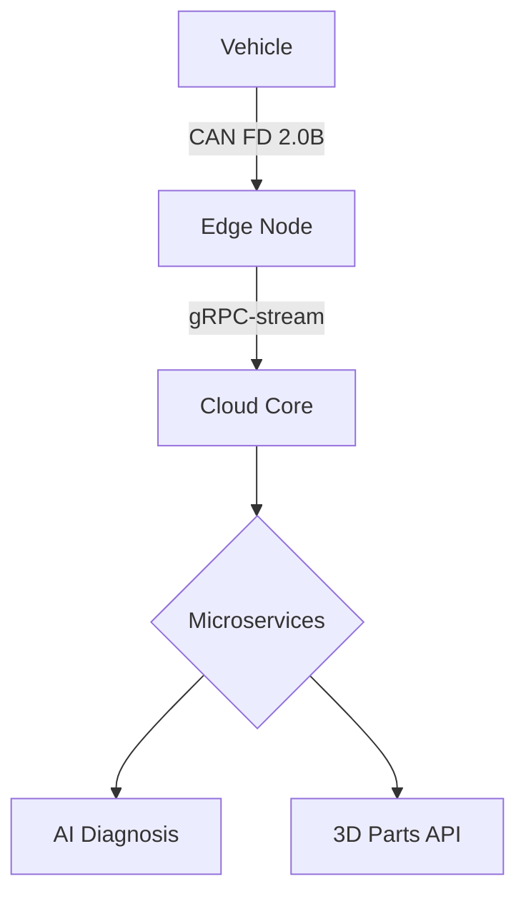

## **1. Core Architecture**


```mermaid
flowchart TD
    A[Vehicle] -->|CAN FD 2.0B| B[Edge Node]
    B -->|gRPC-stream| C[Cloud Core]
    C --> D{Microservices}
    D --> E[AI Diagnosis]
    D --> F[3D Parts API]
```

**Implementation Command:**
```bash
# Generate architecture diagrams
make arch-diagram \
  --input=docs/architecture/specs/ \
  --format=mermaid
```
