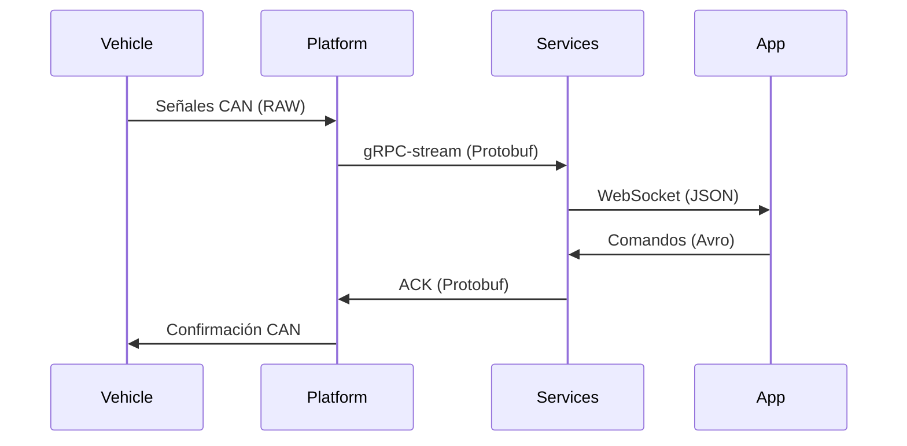

# **Protocolo de Comunicación 4D - MechBot 2.0x**  
**Documento:** `4D_COMMS_PROTOCOL.md`  
**Ubicación:** `docs/architecture/4D_COMMS_PROTOCOL.md`  
**Responsables:** Equipo de Arquitectura - DevOps  

## **Diagrama de Protocolos por Capa**  
```mermaid  
%%{init: {'theme': 'base', 'themeVariables': { 'primaryColor': '#fff2cc'}}}%%  
flowchart TD  
    subgraph FÍSICA["Capa Física"]  
        A[Protocolo CAN 2.0B]  
        B[ISO 15765-4]  
    end  

    subgraph PLATAFORMA["Capa Plataforma"]  
        C[gRPC-stream]  
        D[HTTP/2]  
    end  

    subgraph SERVICIOS["Capa Servicios"]  
        E[Protobuf v3]  
        F[Avro Schema]  
    end  

    subgraph APLICACIÓN["Capa Aplicación"]  
        G[WebSocket]  
        H[gRPC-Web]  
    end  

    FÍSICA -->|Codificación| PLATAFORMA  
    PLATAFORMA -->|Serialización| SERVICIOS  
    SERVICIOS -->|Optimización| APLICACIÓN  
```  

## **Especificaciones Técnicas**  

### **1. Capa Física**  
**Archivo de Configuración:** `config/canbus/can0.conf`  
```ini  
[canbus]  
protocol = "CAN_2.0B"  
bitrate = 1000000  
sample_point = 0.875  
sjw = 1  
```  

**Comandos de Diagnóstico:**  
```bash  
# Monitor CAN en tiempo real  
candump -tA can0  
# Estadísticas del bus  
ip -details -statistics link show can0  
```  

### **2. Capa Plataforma**  
**Archivo Proto:** `proto/telemetry/v2/mechbot.proto`  
```protobuf  
syntax = "proto3";  

message VehicleSignal {  
    uint64 timestamp = 1;  
    string signal_id = 2;  
    oneof value {  
        double numeric = 3;  
        bool boolean = 4;  
        bytes raw = 5;  
    }  
    map<string, string> metadata = 6;  
}  
```  

### **3. Capa Servicios**  
**Configuración Kafka:** `config/kafka/schemas/telemetry.avsc`  
```json  
{  
  "type": "record",  
  "name": "TelemetryRecord",  
  "fields": [  
    {"name": "vehicle_id", "type": "string"},  
    {"name": "signals", "type": {  
      "type": "array",  
      "items": "double"  
    }}  
  ]  
}  
```  

### **4. Capa Aplicación**  
**Configuración WebSocket:** `app/src/engine/ws-config.js`  
```javascript  
const config = {  
  protocols: ['v3.proto'],  
  binaryType: "arraybuffer",  
  reconnectInterval: 5000,  
  maxRetries: 5  
};  
```  

## **Flujo de Mensajería**  


## **Documentación Relacionada**  
📌 [Guía de Optimización CAN](docs/hardware/CAN_OPTIMIZATION.md)  
📌 [Patrones gRPC](docs/architecture/GRPC_PATTERNS.md)  

**Equipo de Arquitectura MechBot**  
🛠️ **Mantenedores:** @network-lead @protocol-eng  
📅 **Versión del Protocolo:** 4D/v2.1.0  
🔗 **Repositorio:** [github.com/mechmind-dwv/protocols](https://github.com/mechmind-dwv/protocols)
