# **Mapa de Despliegue 4 Capas - MechBot 2.0x**  
**Equipo DevOps | Versión 2.1.0**  

```mermaid
%%{init: {'theme': 'base', 'themeVariables': { 'primaryColor': '#ffdfd3', 'edgeLabelBackground':'#fff'}}}%%
flowchart_TD
    A[\n<b>Capa Física</b>\n- Kubernetes Nodes\n- NVIDIA Jetson\n- Raspberry Pi] --> B[\n<b>Capa Plataforma</b>\n- Docker\n- Helm\n- Istio]
    B --> C[\n<b>Capa Servicios</b>\n- API REST\n- gRPC\n- Kafka Streams]
    C --> D[\n<b>Capa Aplicación</b>\n- Dashboard 3D\n- Diagnóstico IA\n- Telemetría]
    
    style A fill:#f9cb9c,stroke:#333
    style B fill:#b6d7a8,stroke:#333
    style C fill:#a2c4c9,stroke:#333
    style D fill:#d5a6bd,stroke:#333
```

## **Detalles Técnicos por Capa**

### **1. Capa Física**  
**Ubicación:** `infra/hardware/README.md`  
```bash
# Nodos Kubernetes (AWS EKS)
kubectl get nodes -o wide
NAME                          STATUS   ROLES    AGE   VERSION
mechbot-node-x86-xx.large     Ready    <none>   45d   v1.27
mechbot-node-arm64-x.medium   Ready    <none>   32d   v1.27
```

### **2. Capa Plataforma**  
**Configuración:** `deploy/platform/values-3d.yaml`  
```yaml
# Configuración Helm para visualización 3D
renderEngine:
  type: "webgl"  # webgl|wasm
  resolution: "4K"
  assets:
    bucket: "mechbot-3d-models"
    cacheTTL: 86400
```

### **3. Capa Servicios**  
**Endpoints Clave:**  
```text
API REST:    https://api.mechbot.tech/v2/diagnostic
gRPC:       mechbot-grpc:50051 (protobuf v3)
Kafka:      vehicle_telemetry (10K msg/sec)
```

### **4. Capa Aplicación**  
**Componentes:**  

```mermaid
pie
    title Distribución de Recursos
    "Dashboard 3D" : 35
    "Modelos IA" : 45
    "Streaming CAN Bus" : 20
```


## **Flujo de Datos 4D**  
```python
# Ejemplo en src/core/data_flow.py
class DataFlow4D:
    def __init__(self):
        self.layers = {
            'physical': CANBusReader(),
            'platform': K8sOrchestrator(),
            'services': GRPCHandler(),
            'app': ThreeDVisualizer()
        }
    
    def process(self, vehicle_signal):
        return [layer.transform(signal) 
                for layer in self.layers.values()]
```

**Equipo DevOps MechBot**  
🏗️ **Documentación Completa:** [Arquitectura 4D](architecture/4D_DEPLOYMENT.md)  
🔄 **Último Despliegue:** 2025-04-10T08:00:00Z  
📊 **Monitorización:** Grafana Dashboard `MechBot-4D`
