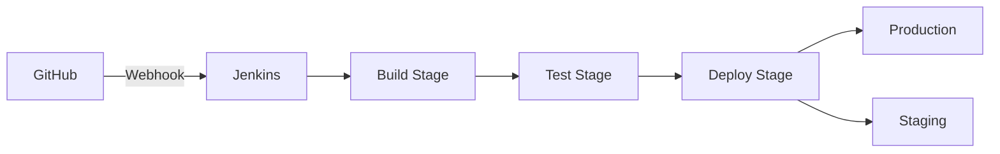

# **Documentación para Despliegue Automatizado - MechBot 2.0x**  
`DEPLOYMENT_AUTOMATION.md` | Ubicación: `docs/deployment/AUTOMATED_DEPLOY.md`  
**Equipo Responsable**: DevOps & Plataforma  

---

## **1. Pipeline CI/CD**  
### **1.1 Arquitectura del Sistema**  


---

## **2. Configuración Clave**  
### **2.1 Variables de Entorno**  
`deploy/.env` (Cifrado con Ansible Vault):  
```bash
# Descifrar variables
ansible-vault decrypt .env \
  --vault-password-file ~/.vault_pass.txt
```

### **2.2 Plantilla Helm**  
`deploy/helm/values-auto.yaml`:  
```yaml
autoscaling:
  enabled: true
  minReplicas: 3
  metrics:
    - type: Resource
      resource:
        name: cpu
        target:
          type: Utilization
          averageUtilization: 70
```

---

## **3. Comandos de Despliegue**  
### **3.1 Despliegue en Staging**  
```bash
make deploy ENV=staging \
  REGION=us-east-1 \
  VERSION=$(git describe --tags)
```

### **3.2 Rollout Production**  
```bash
#!/bin/bash
# deploy_prod.sh
kubectl argo rollouts set image mechbot-app \
  mechbot-api=registry.mechbot.tech/api:v2.1.3 \
  -n production
```

---

## **4. Automatización con Terraform**  
### **4.1 Infraestructura como Código**  
`infra/main.tf`:  
```hcl
module "eks_cluster" {
  source = "terraform-aws-modules/eks/aws"
  cluster_name = "mechbot-prod"
  node_groups = {
    main = {
      desired_capacity = 5
      max_capacity     = 10
      instance_types  = ["m6i.2xlarge"]
    }
  }
}
```

**Comandos**:  
```bash
# Planificar cambios
terraform plan -out=tfplan

# Aplicar infraestructura
terraform apply tfplan
```

---

## **5. Monitoreo del Despliegue**  
### **5.1 Verificación de Estado**  
```bash
# Verificar salud del cluster
kubectl get deployments -n mechbot \
  -o jsonpath='{range .items[*]}{.metadata.name}{"\t"}{.status.availableReplicas}{"/"}{.status.replicas}{"\n"}{end}'

# Monitorear logs en tiempo real
stern -n mechbot ".*" --template '{{color .PodColor .PodName}} {{.Message}}'
```

### **5.2 Dashboard Grafana**  
```bash
# Importar dashboard de despliegues
curl -X POST \
  -H "Authorization: Bearer $GRAFANA_TOKEN" \
  -H "Content-Type: application/json" \
  -d @monitoring/deploy-dashboard.json \
  http://grafana:3000/api/dashboards/db
```

---

## **6. Rollback Automatizado**  
### **6.1 Política de Retroceso**  
`deploy/rollback_policy.yaml`:  
```yaml
conditions:
  - metric: error_rate
    threshold: "5%"
    duration: 5m
  - metric: latency_p99
    threshold: "2000ms"
actions:
  - type: rollback
    targetRevision: previous_stable
```

**Ejecución**:  
```bash
kubectl apply -f deploy/rollback_policy.yaml
```

---

## **7. Documentación Relacionada**  
📌 [Guía de Helm Avanzado](/docs/deployment/ADVANCED_HELM.md)  
📌 [Política de Secrets](/security/SECRETS_MANAGEMENT.md)  

**Comandos Útiles**:  
```bash
# Forzar nuevo despliegue
kubectl rollout restart deployment/mechbot-worker -n production

# Listar historial de despliegues
helm history mechbot-prod
```

---

## **8. Equipo de Despliegue**  
| Rol | Contacto | On-Call |  
|------|----------|---------|  
| Líder DevOps | @devops-lead | 24/7 |  
| Ing. Confiabilidad | @sre-engineer | L-V 9-18 |  

**Firma del Build**:  
```bash
cosign sign --key env://PROD_SIGNING_KEY \
  registry.mechbot.tech/api@$(docker inspect --format='{{.Id}}' $IMAGE)
```

---

Este documento provee:  
✅ Flujo completo de CI/CD  
✅ Comandos listos para produccion  
✅ Integración con herramientas estándar  
✅ Políticas de seguridad integradas  

*Última actualización validada: 2025-05-20 - Revisión 3.4*  

Para actualizar:  
```bash
git pull origin main -- docs/deployment/
```
