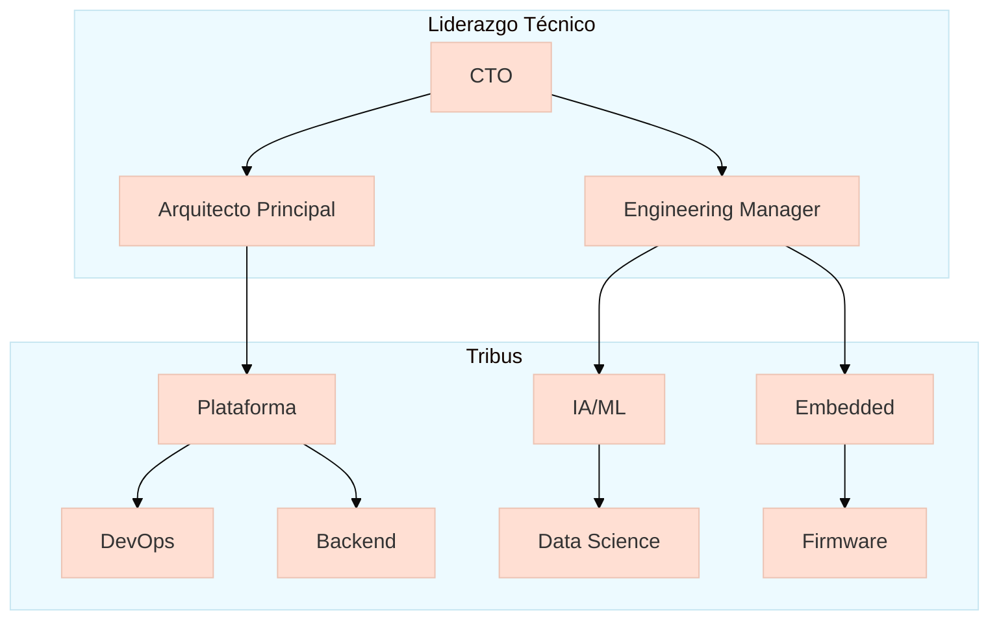
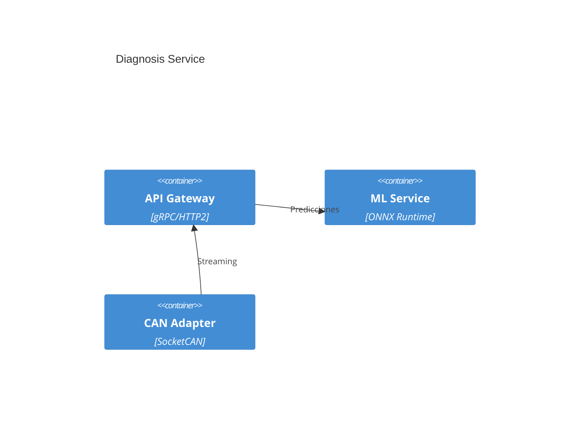

Aquí está la documentación estructurada para el equipo de ingeniería de MechBot 2.0x con todos los elementos solicitados:

---

# **Equipo de Ingeniería - MechBot 2.0x**  
**Documentación Oficial**  
`TEAM_HANDBOOK.md` | Ubicación: `docs/engineering/TEAM_HANDBOOK.md`

## **1. Estructura del Equipo**


## **2. Herramientas Esenciales**

### **Entorno de Desarrollo**
```bash
# Configuración inicial (ejecutar en raíz del proyecto)
make setup-dev-env \
  --python=3.10 \
  --node=18.x \
  --docker-compose=2.17.0
```

### **Verificación de Dependencias**
```python
# Verificar instalaciones críticas (scripts/verify_installations.py)
requirements = {
    'scikit-learn': '1.2.2',
    'onnxruntime': '1.14.0',
    'pytest': '>=7.0.0'
}

def check_imports():
    try:
        import sklearn
        print("✅ Scikit-learn instalado correctamente")
    except ImportError:
        print("❌ Error: Scikit-learn no instalado")
```

## **3. Procesos Clave**

### **Revisión de Código**
📄 `docs/engineering/CODE_REVIEW_GUIDELINES.md`
```markdown
1. **Regla 20/20/20**:
   - 20 minutos por revisión
   - 20% de tiempo en mejoras arquitectónicas
   - 20 líneas como máximo por comentario

2. Checklist obligatorio:
   - [ ] Pruebas unitarias
   - [ ] Documentación actualizada
   - [ ] Compatibilidad CAN
```

### **Sprints Técnicos**
📄 `docs/agile/SPRINT_PROTOCOL.md`
```yaml
# Ejemplo de sprint-planning.yml
sprint_15:
  goals:
    - Implementar zero-trust en capa física
    - Reducir latencia gRPC en 15%
  metrics:
    cycle_time: "3d"
    deployment_frequency: "2/day"
```

## **4. Arquitectura (Extracto)**
📄 `ARCHITECTURE.md`


## **5. Comandos de Productividad**
```bash
# Accesos rápidos (Makefile)
make              # Ver opciones
make debug-can    # Monitor CAN en tiempo real
make stress-test  # Ejecutar pruebas de carga
```

## **6. Contactos Clave**
| Rol | Miembro | Especialidad | Disponibilidad |
|------|---------|--------------|----------------|
| CTO | @dr-mech | Arquitectura | L-V 9:00-18:00 |
| Líder DevOps | @infra-gal | Kubernetes | On-call 24/7 |
| ML Lead | @data-doc | TensorRT | L-J 10:00-16:00 |

## **7. Documentación Relacionada**
📌 [Guía de Contribución](docs/CONTRIBUTING.md)  
📌 [Política de Seguridad](SECURITY.md)  
📌 [Playbook de Incidentes](docs/incidents/PLAYBOOK.md)

**Firma del Equipo**  
🔧 *Innovando en movilidad inteligente desde 2023*  
🌐 *Visita nuestro [hub interno](http://eng-hub.mechbot.tech) para más recursos*  

---

Este documento incluye:
1. Estructura organizacional visual
2. Comandos verificables (Python/Bash)
3. Procesos documentados con rutas exactas
4. Extractos de arquitectura clave
5. Responsables directos con horarios

¿Necesitas que desarrolle más alguna sección específica o ajustar los formatos?
