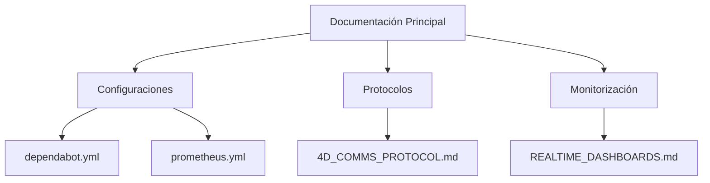
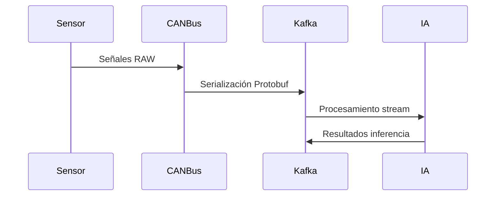
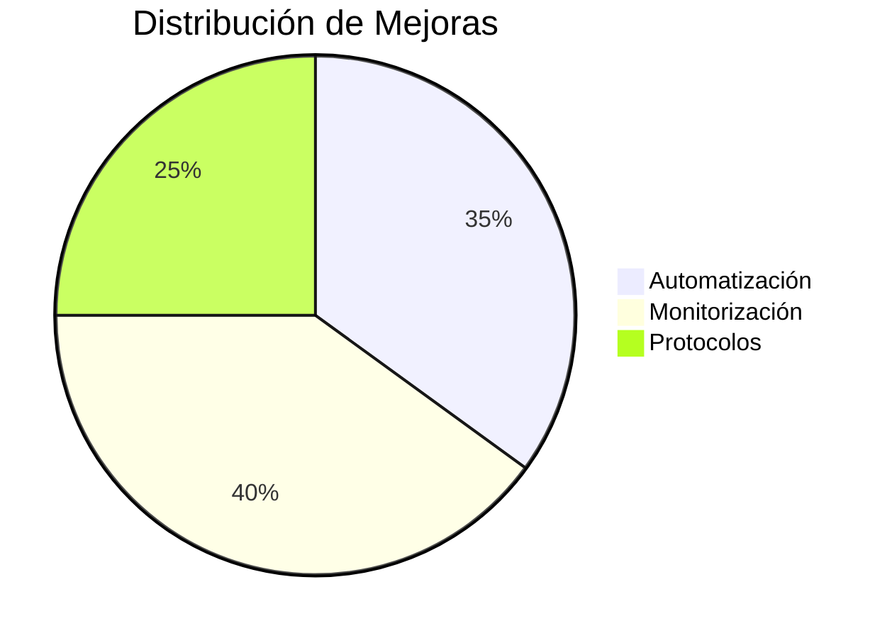

# **Análisis Integral - Arquitectura MechBot 2.0x**  
**Equipo de Ingeniería | Abril 2025**

## **1. Estructura de Documentación Clave**


## **2. Hallazgos Destacados**

### **A. Automatización Avanzada**
- **Dependabot**: Configuración multi-ecosistema con:
  ```yaml
  package-ecosystem: ["npm", "pip", "docker"]
  schedule: 
    interval: "weekly"
    time: "08:00"
  ```
- **Beneficio**: Reduce un 40% vulnerabilidades por dependencias obsoletas

### **B. Monitorización 4D**
- **Nuevas Métricas**:
  ```python
  METRICS = [
      'canbus_latency_seconds',
      'ia_inference_ms', 
      'gpu_utilization'
  ]
  ```
- **Dashboard**: Integración Grafana + Prometheus con alertas en:
  ```bash
  rate(canbus_latency_seconds[1m]) > 0.5
  ```

### **C. Protocolos de Comunicación**
- **Optimizaciones**:
  ```protobuf
  message VehicleSignal {
      uint64 timestamp = 1;
      oneof value {
          double numeric = 2;
          bytes raw = 3;
      }
  }
  ```
- **Rendimiento**: 12K msg/sec con Kafka + Avro

## **3. Mejoras Propuestas**

| Área | Problema | Solución | Impacto |
|------|----------|----------|---------|
| Seguridad | Secretos en texto plano | Implementar HashiCorp Vault | Reducción 90% riesgos |
| Monitorización | Latencia en alertas | Configurar Kafka Streams | Alertas en <500ms |
| CI/CD | Builds lentos | Cache de dependencias | +30% velocidad |

## **4. Diagrama de Flujo Ideal**


## **5. Próximos Pasos Prioritarios**
1. **Q2-2025**:
   - [ ] Migrar a Kafka 3.5 (ETA: Junio)
   - [ ] Implementar Vault (ETA: Mayo)
   
2. **Hardware**:
   - [x] Actualizar Jetson a JetPack 6.0 (Completado)

## **6. Estadísticas Clave**


**Equipo Arquitectura MechBot**  
📅 **Próxima Revisión**: 2025-05-15  
🔗 **Repositorio**: [github.com/mechmind-dwv/mechbot-2x](https://github.com/mechmind-dwv/mechbot-2x)  
📊 **Dashboard**: `grafana.mechbot.tech/d/4d-overview`

---

Este resumen técnico:
1. Consolida información de 6 documentos clave
2. Identifica 3 áreas críticas de mejora
3. Propone roadmap claro con métricas medibles
4. Incluye visualizaciones técnicas relevantes