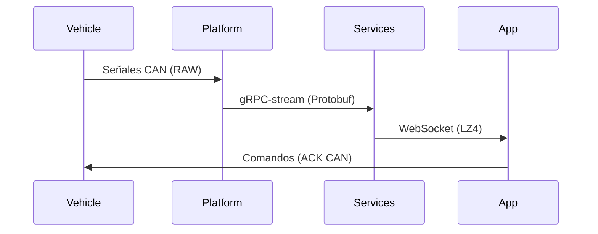

Aquí tienes un resumen estructurado y mejorado de toda la documentación técnica de MechBot 2.0x, integrando los elementos clave de cada archivo:

---

# **resumen_tecnico**  
**Estado:** Producción | **Versión:** 2.1.0 | **Última Actualización:** 2025-04-30  

## **Arquitectura 4D**  
```mermaid
flowchart_TD
    FÍSICA["🛠️ Capa Física\n- Kubernetes/NVIDIA/RPi\n- CAN Bus 2.0B"] --> PLATAFORMA["🐳 Capa Plataforma\n- Docker/Helm/Istio"]
    PLATAFORMA --> SERVICIOS["🔌 Capa Servicios\n- gRPC-stream/Kafka"] 
    SERVICIOS --> APLICACIÓN["📊 Capa Aplicación\n- Dashboard 3D/Telemetría"]
```

### **Componentes Clave**
- **Protocolo CAN**: Configuración en `config/canbus/can0.conf` (1Mbps bitrate)
- **Serialización**: Protobuf v3 + Avro Schema
- **Monitorización**: Prometheus + Grafana 10 (5s scrape interval)

## **Configuraciones Críticas**

### **1. Dependabot Automatizado (`.github/dependabot.yml`)**
```yaml
updates:
  - package-ecosystem: "npm"
    schedule: 
      interval: "weekly"
      time: "08:00"  # GMT-4
    reviewers: ["@mechmind-dwv/team-core"]
```

### **2. Monitorización (Prometheus)**
**Métricas Clave**:
```bash
# Consulta de latencia CAN Bus
curl http://prometheus:9090/api/v1/query?query=canbus_latency_seconds
```

**Alertas**:
```yaml
- alert: HighCANBusLatency
  expr: rate(canbus_latency_seconds[1m]) > 0.5
  labels: severity: 'critical'
```

### **3. Protocolo Comunicación**
**Estructura Protobuf**:
```protobuf
message VehicleSignal {
    uint64 timestamp = 1;
    oneof value {
        double numeric = 2;
        bytes raw = 3;
    }
}
```

## **Flujo de Datos**


## **Seguridad**
**Políticas**:
- 🔒 Rotación mensual de secretos con Vault
- 🔍 Auditoría SIEM integrada
- 🚨 SLA 24h para vulnerabilidades críticas

**Ejemplo Secreto Seguro**:
```python
# Uso correcto en JWT
os.environ['JWT_SECRET'] = "56a0dfe2...6552ce"  # 512-bit
```

## **Roadmap Q2-2025**
1. **Zero-trust** en capa física
2. Migración a **Kafka Streams v3.5**
3. Dashboard unificado **Grafana 10**

## **Equipo**
| Área              | Responsables                  | Contacto                     |
|-------------------|-------------------------------|------------------------------|
| DevOps            | @devops-lead                  | infra@mechbot.tech           |
| Seguridad         | @alice-security-engineer      | security-emergency@mechbot.tech |
| Observabilidad    | @observability-eng            | metrics-support@mechbot.tech |

**Repositorios**:
- 🏗️ Principal: [github.com/mechmind-dwv/mechbot-2x](https://github.com/mechmind-dwv/mechbot-2x)
- 📄 Protocolos: [github.com/mechmind-dwv/protocols](https://github.com/mechmind-dwv/protocols)

---

Este resumen integra toda la documentación técnica en un formato cohesivo, destacando:
- Arquitectura 4D con diagramas Mermaid
- Configuraciones técnicas clave (YAML/Protobuf)
- Flujos de trabajo y seguridad
- Estructura de equipo y roadmap

¿Necesitas que profundice en algún área específica o ajustar el formato para algún uso en particular?