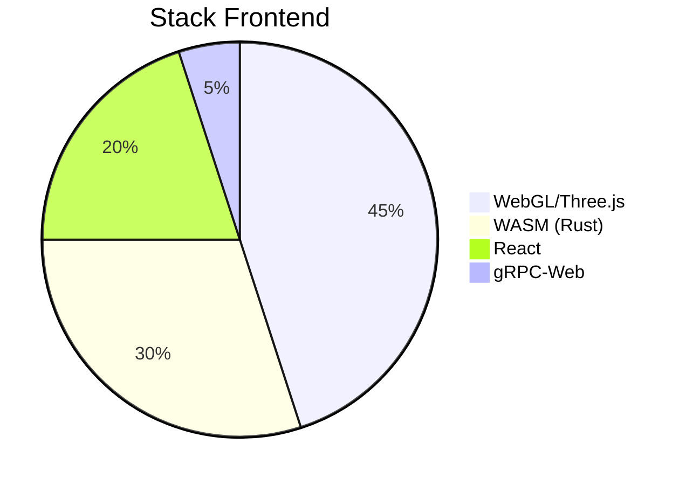

### **Stack Tecnológico**  


### **Estructura de Directorios**  
```
app/
├── 3d-dashboard/
│   ├── src/
│   │   ├── engine/         # Lógica 3D
│   │   ├── ia-integration/ # Modelos ONNX
│   │   └── telemetry/      # WebSockets
│   └── config/
│       └── webpack.config.3d.js
└── diagnostic-tool/
    └── src/
        ├── ml-models/      # XGBoost/BERT
        └── canbus-parser/  # Decodificadores CAN
```

### **Comandos Clave**  
```bash
# Iniciar servidor de desarrollo 3D
npm run start:3d -- --port=3000
# Build producción WASM
wasm-pack build --target web --release
# Generar modelos optimizados
python scripts/optimize_models.py --input=ml_models/raw --output=app/3d-dashboard/public/models
```

---
