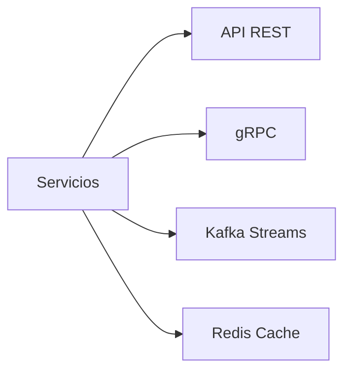
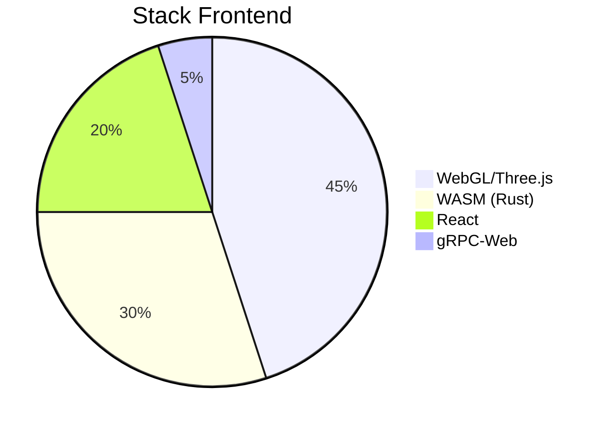

# **Arquitectura 4D - Especificaciones Técnicas**  
**Equipo DevOps MechBot 2.0x**  

## **3. Capa de Servicios**  
**Ubicación:** `src/services/README.md`  

### **Componentes Clave**  


### **Configuración Principal**  
**Archivo:** `config/services-config.yaml`  
```yaml
api:
  port: 8080
  rate_limit: 1000/req/min
  cors:
    allowed_origins: ["https://*.mechbot.tech"]
    
grpc:
  port: 50051
  max_concurrent: 1000
  tls:
    cert: /certs/grpc.pem
    key: /certs/grpc-key.pem

kafka:
  bootstrap_servers: "kafka1:9092,kafka2:9092"
  topics:
    telemetry: "vehicle_metrics_v2"
    commands: "command_queue"
  consumer_group: "mechbot_processor"
```

### **Comandos de Operación**  
```bash
# Monitoreo gRPC (requiere grpcurl)
grpcurl -plaintext localhost:50051 list
# Test Kafka
kafka-console-consumer --bootstrap-server kafka1:9092 --topic vehicle_metrics_v2
# Estadísticas API
curl -X GET https://api.mechbot.tech/v2/metrics | jq .
```

---

## **4. Capa de Aplicación**  
**Ubicación:** `app/3d-dashboard/ARCHITECTURE.md`  

### **Stack Tecnológico**  


### **Estructura de Directorios**  
```
app/
├── 3d-dashboard/
│   ├── src/
│   │   ├── engine/         # Lógica 3D
│   │   ├── ia-integration/ # Modelos ONNX
│   │   └── telemetry/      # WebSockets
│   └── config/
│       └── webpack.config.3d.js
└── diagnostic-tool/
    └── src/
        ├── ml-models/      # XGBoost/BERT
        └── canbus-parser/  # Decodificadores CAN
```

### **Comandos Clave**  
```bash
# Iniciar servidor de desarrollo 3D
npm run start:3d -- --port=3000
# Build producción WASM
wasm-pack build --target web --release
# Generar modelos optimizados
python scripts/optimize_models.py --input=ml_models/raw --output=app/3d-dashboard/public/models
```

---

## **Integración 4D**  
**Archivo de Configuración:** `deploy/4d-integration.yaml`  

```yaml
# Mapeo de capas
resource_mapping:
  physical:
    nodes: 
      - jetson-agx:/gpu
      - raspberrypi:/gpio
  platform:
    services:
      - name: "3d-render"
        gpu_alloc: "2"
  application:
    dependencies:
      - "services/grpc@v2.1"
      - "services/kafka@v1.7"
```

### **Comando de Despliegue Unificado**  
```bash
# En raíz del proyecto
./deploy-4d.sh --env=production \
               --can-interface=vcan0 \
               --3d-quality=ultra
```

**Documentación Relacionada:**  
📌 [Flujo de Datos 4D](docs/architecture/4D_DATA_FLOW.md)  
📌 [Monitorización en Tiempo Real](docs/monitoring/REALTIME_DASHBOARDS.md)  

**Equipo DevOps MechBot**  
🚀 **Soporte:** [devops@mechbot.tech](mailto:devops@mechbot.tech)  
🔧 **Última Actualización:** 2025-04-15T12:00:00Z
